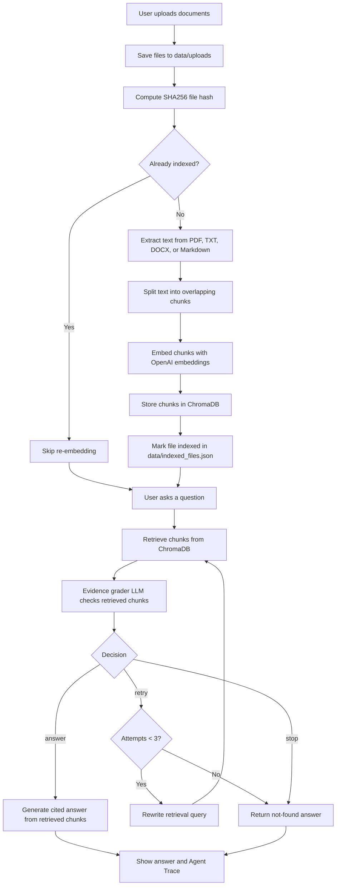
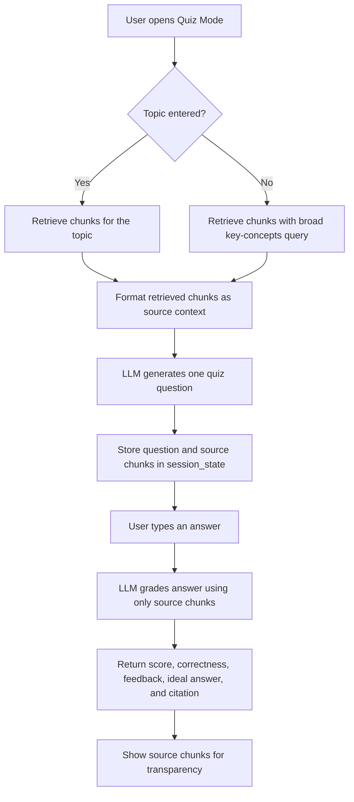

# Agentic RAG Tutor

Agentic RAG Tutor is a Streamlit app for asking questions about uploaded
documents. It extracts text, chunks it, stores embeddings in ChromaDB, retrieves
relevant chunks, evaluates whether the evidence is strong enough, and then
answers with citations. It also includes a Quiz Mode that generates and grades
practice questions from the uploaded documents.

The project is intentionally beginner-friendly and built in milestones, so each
part of the RAG pipeline is easy to inspect.

## Features

- Upload PDF, TXT, DOCX, and Markdown files.
- Save uploaded files to `data/uploads`.
- Extract text with source filename and page metadata when available.
- Split documents into overlapping character-based chunks.
- Store embeddings in persistent ChromaDB storage at `data/chroma`.
- Skip re-indexing files that have already been embedded.
- Retrieve relevant chunks with OpenAI embeddings.
- Use a LangGraph loop to decide whether to answer, retry retrieval, or stop.
- Generate citation-grounded answers using only retrieved chunks.
- Show an Agent Trace so the retrieval and evidence-grading workflow is visible.
- Paste an OpenAI API key in the Streamlit sidebar for the current session.
- Generate and grade quiz questions using only uploaded-document evidence.

## Project Structure

```text
.
|-- app.py
|-- requirements.txt
|-- README.md
|-- data/
|   |-- chroma/
|   |-- uploads/
|   `-- indexed_files.json
|-- src/
|   |-- chunking.py
|   |-- config.py
|   |-- dedup.py
|   |-- graph.py
|   |-- ingest.py
|   |-- prompts.py
|   |-- quiz.py
|   |-- rag.py
|   |-- schemas.py
|   `-- vectorstore.py
`-- tests/
    `-- test_chunking.py
```

## Setup

Create and activate a virtual environment:

```powershell
python -m venv .venv
.\.venv\Scripts\Activate.ps1
```

Install dependencies:

```powershell
pip install -r requirements.txt
```

You can provide an OpenAI API key in either of two ways.

Recommended for app users: paste your key into the Streamlit sidebar under
`API Settings`. The key is kept only in `st.session_state` for the current
session and is not written to disk.

Optional for local development: create a `.env` file in the project root:

```text
OPENAI_API_KEY=your_api_key_here
```

## Run the App

```powershell
streamlit run app.py
```

Then open the local Streamlit URL in your browser.

Before indexing, asking questions, or using Quiz Mode, enter an OpenAI API key
in the sidebar unless you already configured one in `.env`.

## How It Works

### Agentic Workflow Diagram



### Indexing

1. Upload documents in the Streamlit UI.
2. Click `Index documents`.
3. The app saves each file, computes a SHA256 hash, and skips files already in
   `data/indexed_files.json`.
4. New files are extracted into document sections.
5. Sections are split into overlapping chunks.
6. Chunks are embedded with OpenAI embeddings and stored in ChromaDB.

### Ask Questions

1. Open the `Ask Questions` tab.
2. Enter a question about your indexed documents.
3. LangGraph runs an agentic loop:
   - retrieve chunks
   - grade whether the evidence is sufficient
   - retry with a rewritten query if evidence is weak
   - answer with citations when evidence is strong
   - stop if evidence is not found after the retry limit
4. The app shows the final answer and an Agent Trace for transparency.

### Quiz Mode



1. Open the `Quiz Mode` tab.
2. Optionally enter a topic.
3. Click `Generate Quiz Question`.
4. The app retrieves source chunks and asks the LLM to create one grounded quiz
   question.
5. Type your answer and click `Submit Answer`.
6. The app grades your answer using only the source chunks and shows:
   - score
   - correct or incorrect result
   - feedback
   - ideal answer
   - citation
   - source chunks used for grading

## Citation Format

Answers should cite sources like this:

```text
[NIST.AI.100-1.pdf, page 25, chunk 29]
```

If the uploaded documents do not support an answer, the app should respond:

```text
The answer is not found in the uploaded documents.
```

## Tests

Run tests with:

```powershell
pytest tests
```

The current tests focus on document chunking.

## Current Limitations

- Chunking is character-based, not token-aware.
- The app does not implement advanced query planning beyond the current
  evidence-grading retry loop.
- Chroma data is stored locally in `data/chroma`.
- API keys entered in the sidebar are session-only and must be re-entered after
  the Streamlit session resets.
