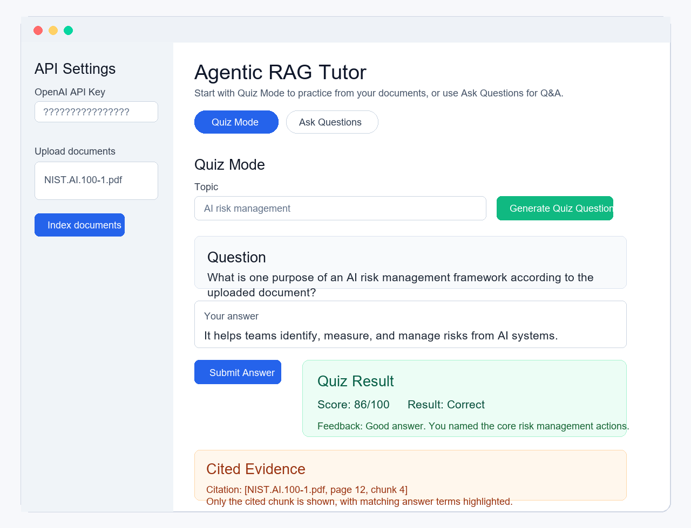
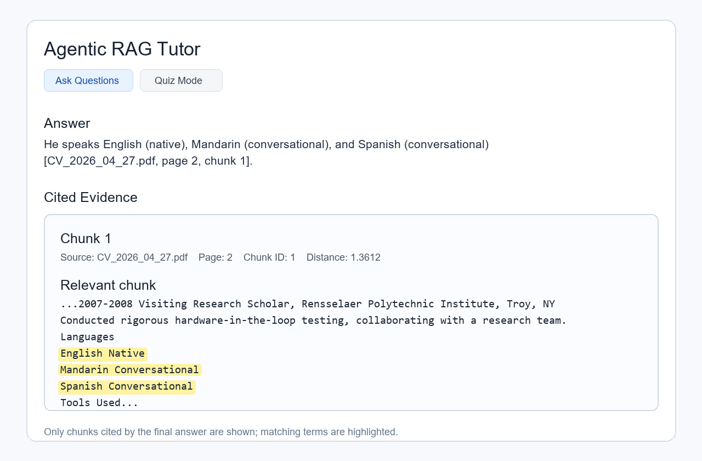
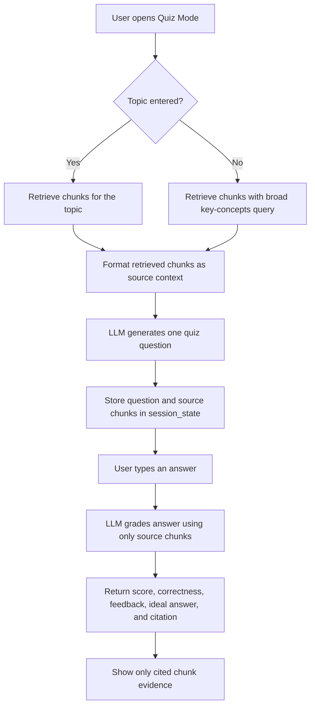
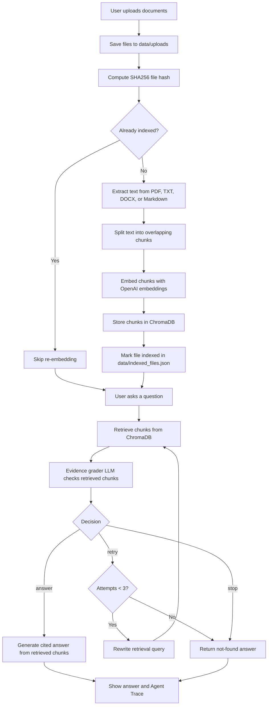

# Agentic RAG Tutor

Agentic RAG Tutor is a Streamlit study app for learning from uploaded
documents. Its main tutoring workflow is Quiz Mode: the app retrieves source
chunks, generates a practice question, grades the user's answer, and shows the
cited evidence used for feedback.

The app also includes an Ask Questions mode for citation-grounded Q&A. In that
mode, it extracts text, chunks it, stores embeddings in ChromaDB, retrieves
relevant chunks, evaluates whether the evidence is strong enough, and answers
with citations.

The project is intentionally beginner-friendly and built in milestones, so each
part of the RAG pipeline is easy to inspect.

## Is This Agentic?

Yes. This is best described as a constrained agentic RAG workflow.

It is not a fully autonomous general-purpose agent. The app uses a focused
LangGraph workflow where the model retrieves evidence, grades whether the
evidence is sufficient, retries with a rewritten query when needed, and only
answers when the retrieved chunks support the response. Those decisions are
shown in the Agent Trace.

## Quiz Mode Example

Quiz Mode is the main learning path. The user can enter a topic, generate a
question from uploaded documents, submit an answer, and receive a score,
feedback, an ideal answer, and cited evidence.



## Ask Questions Example

The app shows only the chunk or chunks cited by the final answer. Matching
answer terms are highlighted inside the full cited chunk.



## Features

- Upload PDF, TXT, DOCX, and Markdown files.
- Save uploaded files to `data/uploads`.
- Extract text with source filename and page metadata when available.
- Split documents into overlapping character-based chunks.
- Store embeddings in persistent ChromaDB storage at `data/chroma`.
- Skip re-indexing files that have already been embedded.
- Paste an OpenAI API key in the Streamlit sidebar for the current session.
- Generate and grade quiz questions using only uploaded-document evidence.
- Show quiz scores, concise feedback, ideal answers, and cited source chunks.
- Retrieve relevant chunks with OpenAI embeddings.
- Use a LangGraph loop in Ask Questions mode to decide whether to answer, retry
  retrieval, or stop.
- Generate citation-grounded answers using only retrieved chunks.
- Show an Agent Trace so the retrieval and evidence-grading workflow is visible.
- Show only the final cited chunk evidence, with matching terms highlighted.

## Project Structure

```text
.
|-- app.py
|-- requirements.txt
|-- README.md
|-- data/
|   |-- chroma/
|   |-- uploads/
|   `-- indexed_files.json
|-- src/
|   |-- chunking.py
|   |-- config.py
|   |-- dedup.py
|   |-- graph.py
|   |-- ingest.py
|   |-- prompts.py
|   |-- quiz.py
|   |-- rag.py
|   |-- schemas.py
|   `-- vectorstore.py
`-- tests/
    `-- test_chunking.py
```

## Setup

Create and activate a virtual environment:

```powershell
python -m venv .venv
.\.venv\Scripts\Activate.ps1
```

Install dependencies:

```powershell
pip install -r requirements.txt
```

You can provide an OpenAI API key in either of two ways.

Recommended for app users: paste your key into the Streamlit sidebar under
`API Settings`. The key is kept only in `st.session_state` for the current
session and is not written to disk.

Optional for local development: create a `.env` file in the project root:

```text
OPENAI_API_KEY=your_api_key_here
```

## Run the App

```powershell
streamlit run app.py
```

Then open the local Streamlit URL in your browser.

Before indexing, asking questions, or using Quiz Mode, enter an OpenAI API key
in the sidebar unless you already configured one in `.env`.

## How It Works

### Step-by-Step Program Flow

1. The user starts the Streamlit app.
2. The user enters an OpenAI API key in the sidebar, or the app falls back to
   `OPENAI_API_KEY` from `.env`.
3. The user uploads one or more documents.
4. The app saves those files into `data/uploads`.
5. The app computes a SHA256 hash for each file.
6. If a file hash is already in `data/indexed_files.json`, the file is skipped
   so the same document is not embedded repeatedly.
7. If the file is new, the app extracts text:
   - PDFs are split by page when possible.
   - TXT and Markdown are treated as one text section.
   - DOCX files are extracted from paragraphs.
8. Extracted sections are converted into overlapping character-based chunks.
9. Before indexing a file, old Chroma chunks for that filename are deleted so
   stale metadata does not remain.
10. New chunks are embedded with OpenAI embeddings.
11. Chunks are stored in the persistent Chroma vector database under
    `data/chroma`.
12. The file hash is recorded in `data/indexed_files.json`.
13. The user chooses either `Quiz Mode` or `Ask Questions`. Quiz Mode appears
    first because the project is designed as a tutor.
14. In `Quiz Mode`, the app retrieves source chunks and uses them to generate
    and grade a practice question.
15. In `Ask Questions`, LangGraph runs the agentic RAG loop.

### Quiz Mode Workflow Diagram



### Indexing

1. Upload documents in the Streamlit UI.
2. Click `Index documents`.
3. The app saves each file, computes a SHA256 hash, and skips files already in
   `data/indexed_files.json`.
4. New files are extracted into document sections.
5. Sections are split into overlapping chunks.
6. Existing chunks for the same source filename are deleted from ChromaDB.
7. Chunks are embedded with OpenAI embeddings and stored in ChromaDB.

### Quiz Mode

1. Select `Quiz Mode`, which is the default mode when the app opens.
2. Optionally enter a topic.
3. Click `Generate Quiz Question`.
4. The app retrieves source chunks and asks the LLM to create one grounded quiz
   question.
5. Type your answer and click `Submit Answer`.
6. The app grades your answer using only the source chunks and shows:
   - score
   - correct or incorrect result
   - feedback
   - ideal answer
   - citation
   - only the cited chunk evidence used for grading

Quiz Mode is not currently the LangGraph retry loop. It is a direct grounded
workflow: retrieve chunks, generate a question, grade the user's answer using
those same chunks, and show cited evidence.

### Ask Questions Workflow Diagram



### Ask Questions

1. Select `Ask Questions`.
2. Enter a question about your indexed documents.
3. LangGraph runs an agentic loop:
   - retrieve chunks
   - grade whether the evidence is sufficient
   - retry with a rewritten query if evidence is weak
   - answer with citations when evidence is strong
   - stop if evidence is not found after the retry limit
4. The app validates that answer citations refer to retrieved chunks.
5. If the model cites a chunk that was not retrieved, the app makes one repair
   call and asks the model to rewrite using only allowed citations.
6. The app shows the final answer.
7. The app shows only the cited evidence chunks below the answer.
8. The app shows the Agent Trace, including retrieval query, decision, reason,
   retry query when present, and retrieved chunk count.

The Agent Trace intentionally does not dump every retrieved chunk. The evidence
section shows only the chunk or chunks cited by the final answer.

## Citation Format

Answers should cite sources like this:

```text
[NIST.AI.100-1.pdf, page 25, chunk 29]
```

If the uploaded documents do not support an answer, the app should respond:

```text
The answer is not found in the uploaded documents.
```

If an answer uses evidence from multiple chunks, the model is instructed to cite
each supporting chunk. The UI parses all citations and displays each cited chunk
under `Cited Evidence`.

## Source File Guide

- `app.py`: Streamlit UI, API-key sidebar, indexing controls, Ask Questions
  mode, Quiz Mode, Agent Trace, and cited evidence display.
- `src/config.py`: shared paths and API-key lookup. UI keys are preferred;
  `.env` is used as a fallback.
- `src/ingest.py`: saves uploaded Streamlit files and extracts text from PDF,
  TXT, DOCX, and Markdown.
- `src/chunking.py`: creates overlapping character-based chunks.
- `src/dedup.py`: computes file hashes and tracks indexed files in
  `data/indexed_files.json`.
- `src/vectorstore.py`: creates embeddings, writes chunks to ChromaDB, retrieves
  chunks, and deletes stale chunks for a source before re-indexing.
- `src/prompts.py`: answer, citation-repair, and evidence-grading prompts.
- `src/graph.py`: LangGraph agentic RAG workflow.
- `src/rag.py`: answer generation, citation validation, citation repair, and
  the `run_agentic_rag()` entry point.
- `src/quiz.py`: quiz question generation, answer grading, scoring rubric, and
  cited-chunk matching.
- `src/schemas.py`: `AgentState` TypedDict used by LangGraph.
- `tests/test_chunking.py`: current unit tests for chunking behavior.

## Tests

Run tests with:

```powershell
pytest tests
```

The current tests focus on document chunking.

## Current Limitations

- Chunking is character-based, not token-aware.
- The app does not implement advanced query planning beyond the current
  evidence-grading retry loop.
- Chroma data is stored locally in `data/chroma`.
- API keys entered in the sidebar are session-only and must be re-entered after
  the Streamlit session resets.
